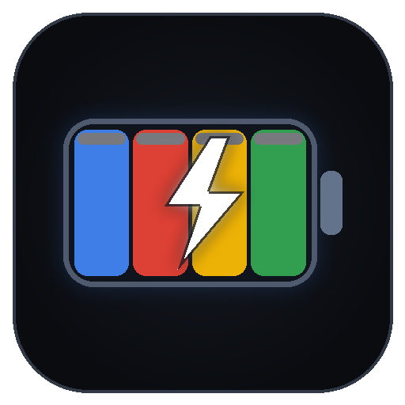

# ⚡ GravityPulse — Antigravity Multi-Model Quota (AGQ) Battery

<p align="center">
  
</p>

<p align="center">
  <strong>Real-time, multi-model battery status bar monitor for Google Antigravity IDE with exact point-to-point decimal precision, model pinning, dedicated hover cards, and Google color coding.</strong>
</p>

<p align="center">
  <a href="https://open-vsx.org/extension/akhilninja/gravity-pulse"></a>
  <a href="https://github.com/Akhil-Prajapati/GravityPulse"></a>
  
  
  
  
</p>

---

## 🌟 Highlights

Unlike traditional quota extensions that round remaining usage into 5% chunks or use artificial mock tokens, **GravityPulse** connects directly to your local running **Antigravity Language Server** to give you 100% genuine server quota, exact point-to-point decimal tracking, multi-model status bar pinning, and server-side auto-refill countdowns.

---

## ✨ Features

- ⚡ **100% Real Live Antigravity Connection**: Direct real-time connection to the local Antigravity Language Server (`GetUserStatus` endpoint) for genuine model quotas and prompt credit balances.
- 🎯 **Point-to-Point Exact Precision (No 5% Gaps)**: Displays real fractional percentages (e.g. `89.5%`, `94.1%`, `100.0%`) point-by-point without rounded jump quantization.
- 📌 **Multi-Model Status Bar Pinning**: Select and display multiple models simultaneously in your status bar with instant checkmark toggles (`✓` / `○`):
  ```
  $(zap) G3.7F: 89.5%   $(zap) Claude: 100.0%   $(zap) Opus: 100.0%
  ```
- 🔍 **Dedicated Single-Model Hover Cards**: Hovering over any model in the status bar displays **only** that specific model's quota card (clean, uncluttered, and instant).
- 🎨 **Dynamic Google Color Palette**:
  - 🟢 **Optimal (`>= 50%`)**: `#34A853` (Google Green)
  - 🟡 **Warning (`20% - 50%`)**: `#FBBC05` (Google Yellow)
  - 🔴 **Critical (`< 20%`)**: `#EA4335` (Google Red) with red alert highlight
- 🔄 **Server Auto-Refill Countdown**: Displays the exact server-provided `resetTime` countdown (`Auto-refills in 4h 19m`).
- 💎 **Carbon Product Icons Ready**: Native styling support for IBM Carbon Product Icons (`$(zap)`, `$(activity)`, `$(flame)`, `$(warning)`, `$(dashboard)`).
- 💳 **Prompt Credits Balance**: Displays monthly overage credit pool (e.g. `500 / 50,000`).

---

## 📱 Status Bar Styles

Customize how your battery levels look in VS Code settings (`gravitypulse.displayStyle`):

| Style | Preview Example | Description |
| :--- | :--- | :--- |
| **Zap Percent** *(Default)* | `$(zap) G3.7F: 89.5%` | Carbon energy zap icon with model abbreviation & decimal percentage |
| **Activity Percent** | `$(activity) Claude: 100.0%` | Carbon pulse activity wave icon |
| **Battery Bar** | `$(zap) G3.7F [███████░] 89.5%` | Unicode segmented charge bar with percentage |
| **Minimalist** | `89.5% $(zap)` | Clean text-first minimalist badge |
| **Detailed** | `$(zap) G3.7F: 89.5% [███████░]` | Model label, decimal percentage, and full progress bar |

---

## 🕹️ Interactive Multi-Model Menu

Click any status bar item or press <kbd>Ctrl</kbd>+<kbd>Shift</kbd>+<kbd>P</kbd> → **`GravityPulse: Open Quota Battery Dashboard`**:

```text
⚡ GravityPulse — Antigravity Quota
Click a model to toggle its visibility in the status bar

✓ $(zap) Gemini 3.7 Flash (High)      ▓▓▓▓▓▓▓░░░ 89.5%    Auto-refills in 4h 19m
✓ $(zap) Claude Sonnet 4.6 (Thinking) ▓▓▓▓▓▓▓▓▓▓ 100.0%   Auto-refills in 4h 58m
○ $(zap) Gemini 3.1 Pro (High)        ▓▓▓▓▓▓▓░░░ 89.5%    Auto-refills in 4h 19m
○ $(zap) Claude Opus 4.6 (Thinking)   ▓▓▓▓▓▓▓▓▓▓ 100.0%   Auto-refills in 4h 58m
○ $(zap) GPT-OSS 120B (Medium)        ▓▓▓▓▓▓▓▓▓▓ 100.0%   Auto-refills in 4h 58m

--- Quick Controls ---
$(sync) Force Refresh Live Quota
$(symbol-color) Change Status Bar Display Style
$(symbol-numeric) Change Percentage Precision
$(settings-gear) Open Extension Settings
```

---

## ⚙️ Extension Settings

| Setting | Default | Description |
| :--- | :--- | :--- |
| `gravitypulse.pinnedModels` | `["Gemini 3.7 Flash (High)", "Claude Sonnet 4.6 (Thinking)"]` | Array of AI models to display simultaneously in the status bar. |
| `gravitypulse.displayStyle` | `"zap-percent"` | Display format (`zap-percent`, `activity-percent`, `battery-bar`, `minimal`, `detailed`). |
| `gravitypulse.precision` | `"single-decimal"` | Percentage precision: `single-decimal` (`89.5%`) or `integer` (`90%`). |
| `gravitypulse.pollingIntervalSeconds` | `30` | Interval in seconds to query local Antigravity Language Server for latest quota. |
| `gravitypulse.warningThreshold` | `20` | Battery percentage below which status bar turns Amber/Yellow. |
| `gravitypulse.criticalThreshold` | `10` | Battery percentage below which status bar turns Red with warning alerts. |
| `gravitypulse.showToastOnLowBattery` | `true` | Show a notification toast when a pinned model drops below critical levels. |

---

## 🚀 Commands

| Command | Identifier | Description |
| :--- | :--- | :--- |
| **Open Quota Dashboard** | `gravitypulse.showDashboard` | Opens the interactive model toggle and quota management menu. |
| **Switch Model** | `gravitypulse.switchModel` | Quick command to toggle pinned models. |
| **Refresh Live Quota** | `gravitypulse.syncAntigravityLogs` | Manually triggers an instant query to the Antigravity Language Server. |

---

## 📥 Installation

### From Open VSX Registry (Antigravity IDE / VSCodium):
1. Open the Extensions view (<kbd>Ctrl</kbd>+<kbd>Shift</kbd>+<kbd>X</kbd>).
2. Search for **`GravityPulse`** or **`akhilninja.gravity-pulse`**.
3. Click **Install**.

### Manual VSIX Installation:
1. Download the latest `.vsix` from [Releases](https://github.com/Akhil-Prajapati/GravityPulse/releases).
2. Press <kbd>Ctrl</kbd>+<kbd>Shift</kbd>+<kbd>P</kbd> → **`Extensions: Install from VSIX...`**.
3. Select `gravity-pulse-1.0.0.vsix`.

---

## 🛠️ Development & Building

```bash
# Clone repository
git clone https://github.com/Akhil-Prajapati/GravityPulse.git
cd GravityPulse

# Install dependencies
npm install

# Run unit tests
npm test

# Compile TypeScript
npm run compile

# Package as marketplace VSIX
npm run package
```

---

## 📄 License

MIT © [Akhil Prajapati](https://github.com/Akhil-Prajapati)
