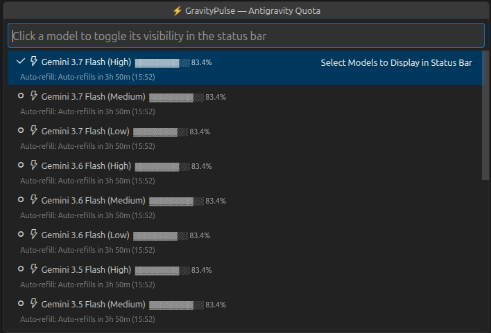
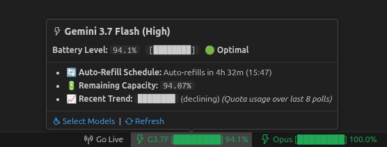
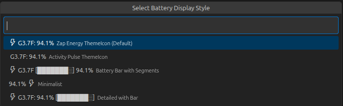

# ⚡ GravityPulse — Antigravity AI Quota (AGQ) Battery

<p align="center">
  
</p>

<p align="center">
  <strong>The #1 Real-Time Quota & Battery Monitor for Google Antigravity & VS Code</strong><br>
  <em>Live Server Quota • Multi-Tier Anti-Spam Alerts • Burn-Rate Pace Estimator • Trend Sparklines • Prompt Credits Pool</em>
</p>

<p align="center">
  <a href="https://open-vsx.org/extension/akhilninja/gravity-pulse"></a>
  <a href="https://github.com/Akhil-Prajapati/GravityPulse"></a>
  
  
  
</p>

---

## 🚀 Never Get Throttled Mid-Task Again

Have you ever been in the middle of a complex refactor or architectural design with Antigravity AI, only to hit an **unexpected quota wall** with zero warning?

**GravityPulse** fixes that permanently. It brings a sleek, phone-style real-time battery status bar monitor to Antigravity IDE and VS Code. Sitting quietly in your bottom bar, it connects directly to your local **Antigravity Language Server** to track exact live percentages, calculate remaining burn time, plot historical trend sparklines, and alert you before you run out of tokens.

> **Trending AI Models Supported:** Gemini 3.8 Flash (High/Medium/Low), Gemini 3.7 Flash, Gemini 3.6 Flash, Gemini 3.5 Flash, Gemini 3.1 Pro, Claude Sonnet 4.6 (Thinking), Claude Opus 4.6, GPT-OSS 120B, and Available Monthly Prompt Credits.

---

## 📸 Visual Overview

<div align="center">
  <table style="border: none; border-collapse: collapse;">
    <tr>
      <td width="50%" align="center" style="border: none; padding: 8px;">
        <strong>🕹️ Interactive Multi-Model Dashboard</strong><br><br>
        
      </td>
      <td width="50%" align="center" style="border: none; padding: 8px;">
        <strong>🎨 5 Customizable Battery Styles</strong><br><br>
        
      </td>
    </tr>
  </table>
</div>

---

## 🌟 Key Features

### 1. ⚡ 100% Real Live Server Connection
- Directly queries the local Antigravity Language Server (`/exa.language_server_pb.LanguageServerService/GetUserStatus`) with auto-discovery across Windows, Linux, and macOS.
- Point-to-point decimal accuracy (e.g. `94.1%`, not rounded estimates like `~90%`).

### 2. ⏳ Burn-Rate & Time-to-Empty Pace Estimator
- Automatically analyzes your rolling polling buffer to estimate how long before your active model runs out of quota.
- Passively surfaces right under the quota line: **`~38m until empty at current pace`** or **`~1h 15m until empty at current pace`**.
- Omitted automatically when quota is flat or recharging.

### 3. 📈 Historical Usage Sparklines & Plain-Language Trends
- Visualizes recent quota history via inline unicode block sparklines (e.g., `▇▆▅▅▄▃▂ `).
- Features clear, plain-language trend labels:
  - **`▃▄▅▆ (declining)`** — Quota is being consumed.
  - **`██████ (stable)`** — Quota is flat and preserved.
  - **`▃▅▇ (rising)`** — Model is recharging or refilled.
  - **`— (gathering data)`** — Initializing on startup.
- Stores history locally in `globalState` (capped at 100 points) and prunes data older than 24 hours automatically.

### 4. 🔔 Multi-Tier Anti-Spam Quota Alerts
- **3 Threshold Tiers**: Info (`20%`), Critical (`10%`), and Severe (`5%`).
- **Clean Crossing Only**: Only fires on clean downward transitions not yet alerted in the current cycle.
- **Refill Reset**: Automatically resets state when quota increases.
- **2-Cycle Debounce**: Flapping protection prevents annoying alert spam near boundary points.
- **Global Cooldown**: Enforces max 1 toast per 2 minutes across all sources.
- **Pinned Only**: Never fires alerts for models you haven't pinned.

### 5. 💳 Dedicated Prompt Credits Pool Tracking
- Monitors your monthly overage credit pool (e.g. `12,000 / 50,000` credits) independently from per-model quota.
- Dedicated threshold alerts (`25%` Info, `10%` Critical, `3%` Severe) with clear messaging distinguishing credits from model quotas.

### 6. 📌 Multi-Model Status Bar Pinning
- Pin multiple models simultaneously in your status bar with quick checkmark toggles.
- Individual hover cards for each pinned model with deep quota analytics, refill schedules, burn rate, and sparklines.

### 7. 📅 Group Weekly Limit & Days-Based Refill Countdowns
- Concurrently queries `/RetrieveUserQuotaSummary` to track shared weekly limits across Gemini, Claude, and GPT model groups.
- Displays human-friendly countdowns in days and hours (e.g., **`6d 2h`** instead of confusing raw hours like `146hr left`).
- Renders **Weekly Limit** directly under Remaining Capacity in hover cards and provides visual gauges in the dashboard.
- Protects against false 100% readings when quota is depleted.

---

## 📖 User Guide: How to Use GravityPulse

### 1. Opening the Dashboard
- Click any GravityPulse battery icon in the status bar, or press <kbd>Ctrl</kbd>+<kbd>Shift</kbd>+<kbd>P</kbd> (<kbd>Cmd</kbd>+<kbd>Shift</kbd>+<kbd>P</kbd> on Mac) and select:
  ```
  GravityPulse: Open Quota Battery Dashboard
  ```
- **Pin / Unpin Models**: Simply click any model in the list to toggle its checkmark `$(check)`. Checked models immediately display in your status bar.

### 2. Switching Status Bar Styles
Open the dashboard and select **`Change Status Bar Display Style`** (or change `gravitypulse.displayStyle` in Settings):
- **Battery Bar (Default)**: `⚡ G3.7F [███████░] 94.1%`
- **Zap Percent**: `⚡ G3.7F: 94.1%`
- **Activity Percent**: `📶 G3.7F: 94.1%`
- **Minimalist**: `94.1% ⚡`
- **Detailed**: `⚡ G3.7F: 94.1% [███████░]`

### 3. Switching Percentage Precision
Choose between:
- **Single Decimal (Default)**: Real-time exact float (`94.1%`)
- **Exact Integer**: Rounded whole percentage (`94%`)

### 4. Force-Refreshing Live Quota
If your computer wakes from sleep or you switch networks, click **`Force Refresh Live Quota`** or run:
```
GravityPulse: Refresh Live Quota from Antigravity Server
```

---

## 🚦 Battery Color Scheme

| Icon & Color | Battery Level | Status & Recommendations |
| :--- | :--- | :--- |
| 🟢 **Green** (`#34A853`) | **70% – 100%** | **Optimal** — Full speed, no rationing needed. |
| 🟡 **Lime** (`#9ACD32`) | **40% – 70%** | **Good** — Healthy charge level. |
| 🟠 **Orange** (`#FB8C00`) | **20% – 40%** | **Moderate Warning** — Consider pacing heavy prompts. |
| 🔴 **Red** (`#EA4335`) | **< 20%** | **Critical Alert** — Approaching rate limit; switch models or conserve. |

---

## ⚙️ Extension Settings Reference

All settings can be customized in VS Code Settings (<kbd>Ctrl</kbd>+<kbd>,</kbd> → search `gravitypulse`):

| Setting | Default | Description |
| :--- | :--- | :--- |
| `gravitypulse.pinnedModels` | `["Gemini 3.6 Flash (Medium)"]` | AI models displayed simultaneously in the status bar. |
| `gravitypulse.displayStyle` | `"battery-bar"` | Visual status bar style (`battery-bar`, `zap-percent`, `activity-percent`, `minimal`, `detailed`). |
| `gravitypulse.precision` | `"single-decimal"` | Numeric format (`single-decimal` or `integer`). |
| `gravitypulse.pollingIntervalSeconds` | `30` | Interval in seconds between live Language Server polls. |
| `gravitypulse.warningThreshold` | `20` | Battery % threshold where status bar turns Amber/Yellow. |
| `gravitypulse.criticalThreshold` | `10` | Battery % threshold where status bar turns Red and triggers Critical alerts. |
| `gravitypulse.infoThreshold` | `20` | % threshold for informational low-quota alert toasts. |
| `gravitypulse.severeThreshold` | `5` | % threshold for severe low-quota alert toasts. |
| `gravitypulse.globalAlertCooldownMinutes` | `2` | Global anti-spam cooldown in minutes between toasts across all models. |
| `gravitypulse.burnRateSampleCount` | `5` | Number of rolling samples used to compute burn-rate and time-to-empty. |
| `gravitypulse.creditsInfoThreshold` | `25` | Prompt credits % threshold for Info tier alert. |
| `gravitypulse.creditsCriticalThreshold` | `10` | Prompt credits % threshold for Critical tier alert. |
| `gravitypulse.creditsSevereThreshold` | `3` | Prompt credits % threshold for Severe tier alert. |
| `gravitypulse.showToastOnLowCredits` | `false` | Master toggle to show or suppress prompt credits toasts (disabled by default). |
| `gravitypulse.showToastOnLowBattery` | `true` | Master toggle to enable or suppress model notification toasts. |

---

## 🎮 Command Palette Commands

| Command | Identifier | Description |
| :--- | :--- | :--- |
| **Open Quota Battery Dashboard** | `gravitypulse.showDashboard` | Opens the interactive model toggle and quota overview menu. |
| **Switch Displayed Model** | `gravitypulse.switchModel` | Quick command to toggle pinned models. |
| **Refresh Live Quota** | `gravitypulse.syncAntigravityLogs` | Manually scans and queries the local Antigravity Language Server. |

---

## 📥 Installation

### From Open VSX (Antigravity IDE / VSCodium):
1. Open the Extensions view (<kbd>Ctrl</kbd>+<kbd>Shift</kbd>+<kbd>X</kbd>).
2. Search for **`GravityPulse`** or **`akhilninja.gravity-pulse`**.
3. Click **Install**.

### Manual VSIX Installation:
1. Download the latest `.vsix` from [Releases](https://github.com/Akhil-Prajapati/GravityPulse/releases).
2. Press <kbd>Ctrl</kbd>+<kbd>Shift</kbd>+<kbd>P</kbd> → **`Extensions: Install from VSIX...`**.
3. Select `gravity-pulse-1.0.7.vsix`.

---

## 🎭 The "We've All Been There" Scenarios

<div align="center">
  <table>
    <tr>
      <td>
        <h3>🌙 1. The 2:00 AM Agent Marathon</h3>
        <p>You’re 95% done generating a complete full-stack refactor with Antigravity AI agent. You fire one last prompt... and BAM: <strong>429 Throttled</strong>. The momentum is ruined. With GravityPulse, the <em>burn-rate pace estimator</em> alerts you beforehand so you can switch models without losing your flow.</p>
      </td>
    </tr>
    <tr>
      <td>
        <h3>🏎️ 2. The F1 Pit-Crew Model Tag-Team</h3>
        <p>Why stick to one model? Pin <strong>Gemini 3.7 Flash</strong>, <strong>Claude Sonnet 4.6</strong>, and <strong>GPT-OSS</strong> side-by-side. When Gemini's battery dips below 20%, seamlessly switch to Claude with zero downtime.</p>
      </td>
    </tr>
    <tr>
      <td>
        <h3>🔋 3. Phone-Style Battery Peace of Mind</h3>
        <p>You wouldn't leave home with 4% phone battery without a charger. Don't start massive agentic coding tasks without knowing your token charge. One glance at your status bar gives you total confidence.</p>
      </td>
    </tr>
  </table>
</div>

---

## 💡 Pro-Gamer Power User Tips

- **⚡ Tip 1: The Triple-Cockpit Setup**  
  Pin 1 Ultra-Fast Model (`Gemini 3.7 Flash`) + 1 Deep Reasoning Model (`Claude Sonnet 4.6 Thinking`) + `Prompt Credits`. You'll always know your exact capacity at every tier.
- **⏳ Tip 2: The Coffee-Break Pace Indicator**  
  If the hover card says `~15m until empty at current pace`, check the `Auto-Refill Schedule`. If it refills in 10 minutes, grab a quick coffee and come back to a 100% full tank!
- **🎨 Tip 3: Aesthetic Customization**  
  Prefer a distraction-free IDE? Switch to **`Minimalist`** (`94.1% ⚡`). Love retro cyberpunk terminal vibes? Switch to **`Battery Bar`** (`⚡ G3.7F [███████░] 94.1%`).

---

## 📊 Visual Battery Gauge Cheatsheet

```text
[████████] 100%  🟢  MAX CHARGE       — Full speed ahead, fire heavy agent tasks!
[██████░░]  75%  🟢  HEALTHY LEVEL    — Cruising smoothly with plenty of headroom.
[████░░░░]  50%  🟡  HALF TANK        — Standard workload, monitor active burns.
[██░░░░░░]  25%  🟠  MODERATE WARNING — Pace prompts, check auto-refill schedule.
[█░░░░░░░]  10%  🔴  CRITICAL ALERT   — Switch models or switch to lightweight tasks!
[░░░░░░░░]   0%  🔥  EXHAUSTED        — Auto-refill timer countdown active.
```

---

## ⭐ Enjoying GravityPulse?

If GravityPulse has saved you from hitting unexpected rate limits and saved your flow-state, please leave a ⭐ **5-star review** on [Open VSX](https://open-vsx.org/extension/akhilninja/gravity-pulse) and star our [GitHub Repository](https://github.com/Akhil-Prajapati/GravityPulse)!

---

## 🏷️ Search Tags & Keywords
`antigravity quota` • `google antigravity` • `gemini 3.7 flash` • `gemini 3.6 flash` • `gemini 3.5 flash` • `claude 3.7 sonnet` • `claude sonnet 4.6` • `claude opus` • `gpt-oss` • `ai battery` • `token monitor` • `burn rate` • `rate limit monitor` • `sparkline trend` • `ai developer tools` • `prompt credits` • `vscodium` • `antigravity ide` • `realtime quota battery`

## 📄 License

MIT © [Akhil Prajapati](https://github.com/Akhil-Prajapati)

